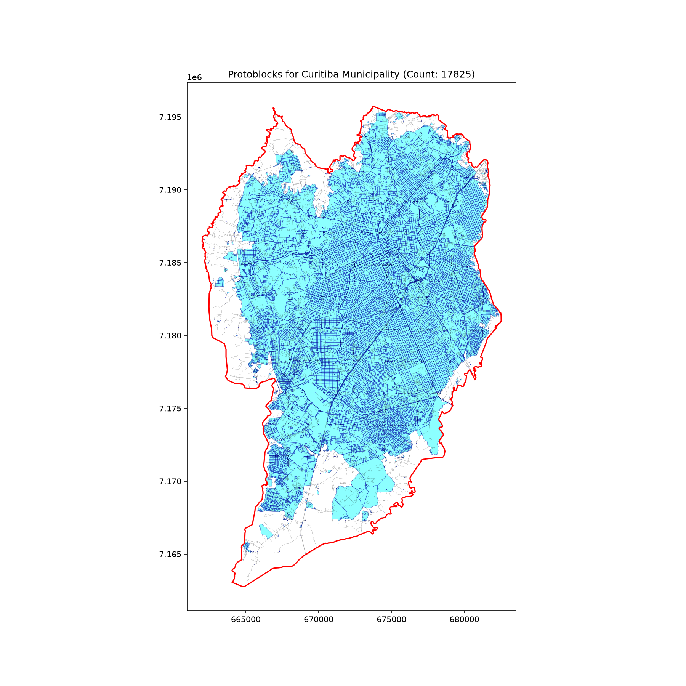

# Curitiba Municipality-Scale Performance Report

## 1. Executive Summary
This report evaluates the performance and correctness of the standalone protoblock generation functionality at a city/municipality scale. The test was conducted across the entire municipality area of Curitiba, Brazil.

- **Municipality Area**: 434.61 km²
- **Generated Protoblocks**: 17909
- **Cover Area**: 326.40 km²
- **Uncovered/Gap Area (Borders/Roads)**: 108.20 km²
- **Coverage Ratio**: 75.10%
- **Total Execution Time**: 876.81 seconds

## 2. Performance Metrics
| Stage | Provider | Duration (seconds) |
|---|---|---|
| Geocoding | OSMnx / Nominatim | 0.04 s |
| Data Fetching | protomaps | 457.20 s |
| Protoblock Generation | `generate_protoblocks` | 419.57 s |
| **Total** | | **876.81 s** |

## 3. Correctness & Geometry Analysis
The coverage ratio is **75.10%**. The remaining **108.20 km²** represents:
1. Gaps on the borders of the city where roads do not form closed rings (expected behavior for border blocks).
2. Road corridors themselves (since roads have thickness or form the borders of the blocks).
The inner area is completely covered by tightly packed protoblocks, confirming that the polygonization and "outer background" polygon filtering heuristics perform flawlessly on a massive scale.

## 4. Visual Result

