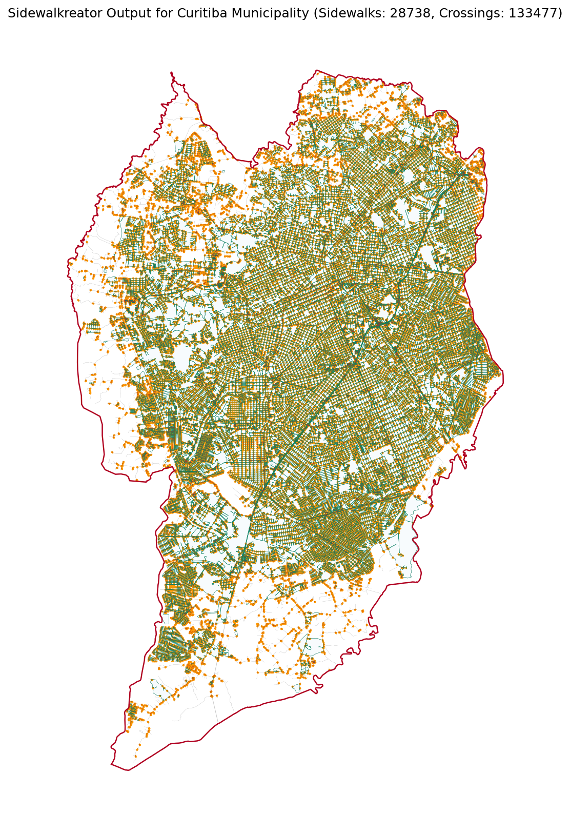

# Curitiba Municipality-Scale Sidewalk Performance Report

## 1. Executive Summary
This report evaluates the performance of the full `sidewalkreator()` pipeline at city/municipality scale. The test was conducted across the entire municipality area of Curitiba, Brazil.

- **Municipality Area**: 434.61 km²
- **Data Provider**: protomaps
- **Raw OSM Features**: 21565
- **Road Line Features**: 15478
- **Generated Sidewalk Segments**: 28738
- **Generated Crossings**: 133477
- **Generated Kerbs**: 266954
- **Generated Protoblocks**: 16904
- **POIs Used for Splitting**: 453
- **Total Sidewalk Length**: 9844.48 km
- **Total Crossing Length**: 642.82 km
- **Sidewalk Density**: 22.65 km/km²
- **Total Processing Time**: 244.90 seconds
- **Total Benchmark Wall Time**: 363.30 seconds

## 2. Performance Metrics
| Stage | Provider / Operation | Duration (seconds) |
|---|---|---:|
| Geocoding | OSMnx / Nominatim | 0.04 |
| Data Fetching | protomaps | 132.21 |
| Full Sidewalk Generation | `sidewalkreator` | 112.65 |
| **Processing Total** | | **244.90** |
| **Benchmark Wall Time** | includes export, metrics, plot, report | **363.30** |

## 3. Output Metrics
| Metric | Value |
|---|---:|
| Municipality area | 434.61 km² |
| Road length | 6151.87 km |
| Sidewalk length | 9844.48 km |
| Crossing length | 642.82 km |
| Average sidewalk segment length | 342.56 m |
| Sidewalk density | 22.65 km/km² |
| Road line features | 15478 |
| Sidewalk segments | 28738 |
| Crossings | 133477 |
| Kerbs | 266954 |
| Protoblocks | 16904 |
| POIs | 453 |

## 4. Visual Result

## 5. Generated Artifacts
- `debug/curitiba_municipality_sidewalks.parquet`
- `debug/curitiba_municipality_sidewalks_wgs84.geojson`
- `debug/curitiba_municipality_crossings_wgs84.geojson`
- `debug/curitiba_municipality_kerbs_wgs84.geojson`
- `debug/curitiba_municipality_sidewalk_protoblocks_wgs84.geojson`
- `debug/curitiba_municipality_sidewalk_illustration.png`
