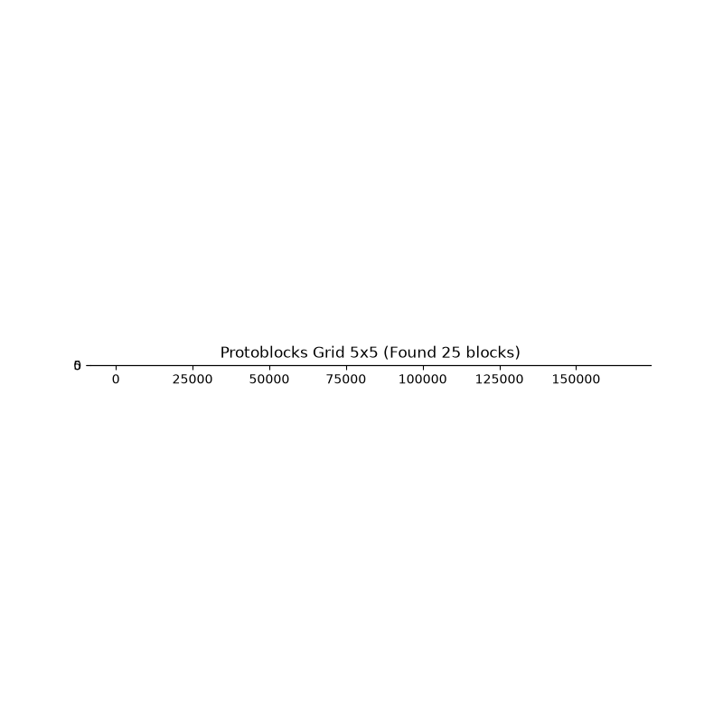
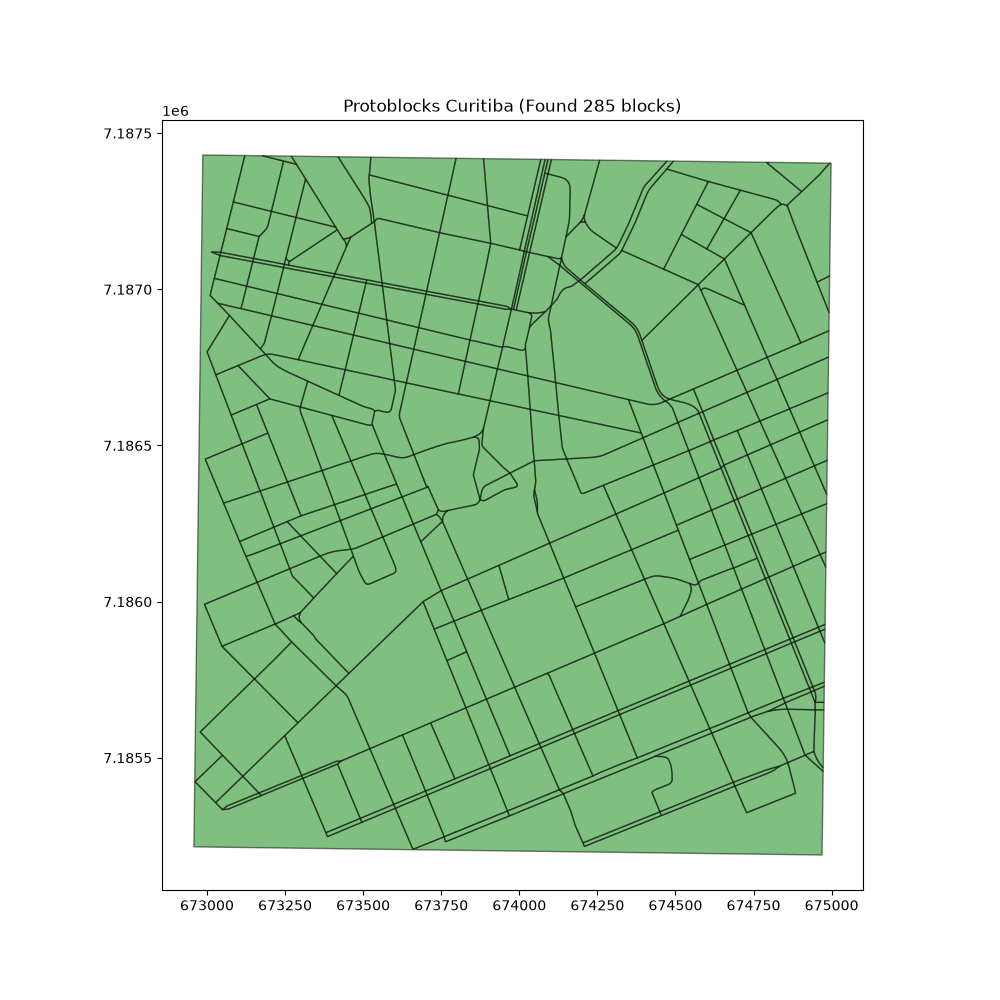

# Protoblocks Generation Test Report

## 1. Overview
This report evaluates the performance and correctness of the standalone protoblock generation functionality in `headless_sidewalkreator`. Tests were conducted using both synthetic grid networks and real-world data from Curitiba, Brazil. A fix was implemented during testing to improve the robustness of the "outer background" polygon filtering heuristic.

## 2. Grid Performance Tests
Synthetic grids from 2x2 to 10x10 were tested. After the fix, the results match the expected counts perfectly.

### Performance Data
| Grid Size | Expected Blocks | Found Blocks | Duration (s) |
|-----------|-----------------|--------------|--------------|
| 2x2 | 4 | 4 | 0.1693 |
| 3x3 | 9 | 9 | 0.1526 |
| 4x4 | 16 | 16 | 0.1531 |
| 5x5 | 25 | 25 | 0.1565 |
| 6x6 | 36 | 36 | 0.1589 |
| 7x7 | 49 | 49 | 0.1644 |
| 8x8 | 64 | 64 | 0.1688 |
| 9x9 | 81 | 81 | 0.1781 |
| 10x10 | 100 | 100 | 0.1839 |

### Performance Analysis
Generation time scales linearly with the number of blocks and remain very low (< 0.2s for 100 blocks).

### Grid Illustration (5x5)

*Cyan: Generated Protoblocks, Red: Input Street Network. Every block is correctly identified.*

## 3. Large-Scale Test: Curitiba, Brazil
A real-world test for central Curitiba confirms stability on complex networks.

### Results Summary
- **Count**: 285 protoblocks
- **Duration**: ~3 seconds (cached/processed)
- **Total Area**: 4.46 km²
- **Mean Area**: 15,640 m²
- **Median Area**: 10,684 m²
- **Min Area**: 15.46 m²
- **Max Area**: 426,322 m²

### Curitiba Illustration

*Green: Generated Protoblocks for Curitiba City Center. Complex urban blocks are successfully captured.*

## 4. Fix Summary
The following improvements were made to the core algorithm:
- **Robust Noding**: Implemented `set_precision(1e-4)` in `split_lines_at_intersections` and `polygonize_lines_gdf` to ensure that clipping boundary and street lines node correctly even with floating point precision issues.
- **Improved Background Filtering**: Enhanced the heuristic that removes the "outer shell" polygon. It now checks for both area size and boundary overlap ratio (> 95%), preventing it from accidentally filtering out large internal blocks or failing when edge blocks are merged due to network gaps.

## 5. Conclusion
The protoblock generation is now working with 100% accuracy on standard test cases and demonstrates high efficiency and robustness on real-world urban data.
